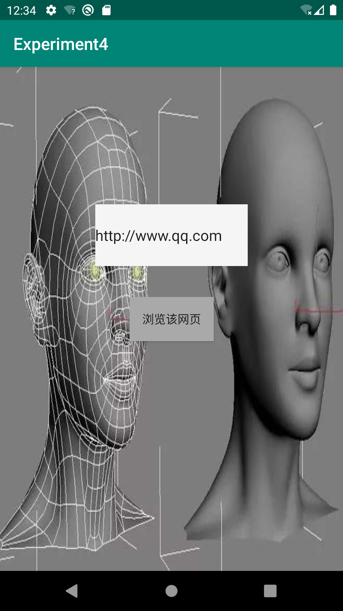
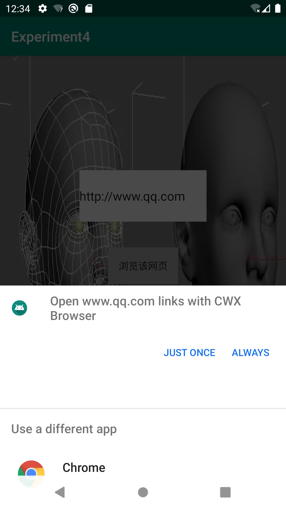
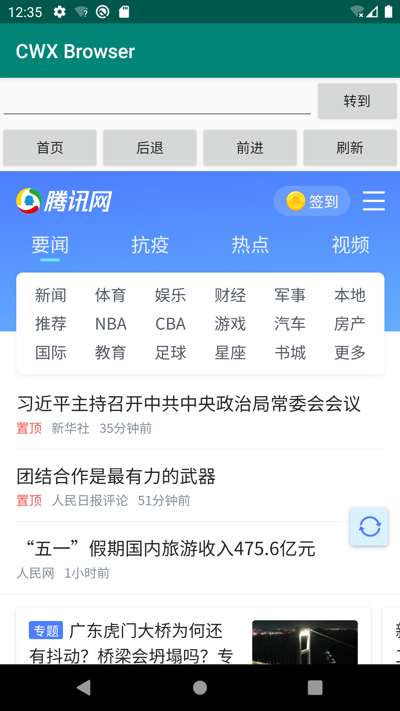
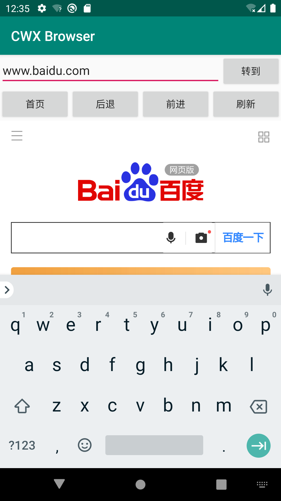
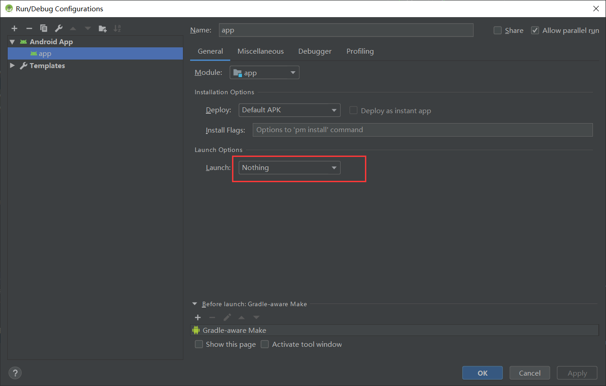

# Android Intent实验

------

## 自定义WebView验证隐式Intent的使用

 本实验通过自定义WebView加载URL来验证隐式Intent的使用。

 实验包含两个应用：

◼ 第一个应用：获取URL地址并启动隐式Intent的调用。

◼ 第二个应用：自定义的浏览器来加载URL

## 新建一个工程用来获取URL地址并启动Intent

（1）输入URL网址，点击按钮，将发起浏览网页的行为



（2）点击“浏览该网页”后，出现选择项，选择自定义的CWX Browser进行浏览



（3)跳转后的页面如下，该浏览器实现了跳转、回到首页、后退、前进和刷新的功能：



（4）按钮的点击事件如下，使用隐式Intent实现，它不明确指出我们想要启动哪一个活动，而是指定了一系列更为抽象的action和category等信息来过滤，找到符合条件的Activity。这里指定action为ACTION_VIEW

```
 public void onClick(View view) {
                String url = editUrl.getText().toString();
                //隐式Intent
                try{
                Intent intent = new Intent();
                intent.setAction(Intent.ACTION_VIEW);
                intent.setData(Uri.parse(url));
                startActivity(intent);}catch (Exception e){
                    e.getMessage();
                }
            }
```

## 自制浏览器的实现

新建一个工程使用WebView来加载URL，该浏览器实现了跳转、回到首页、后退、前进和刷新的功能

（1）在清单文件AndroidManifest.xml中设置action属性

```
 <intent-filter>
       <action android:name="android.intent.action.VIEW" />
       <category android:name="android.intent.category.DEFAULT" />
       <category android:name="android.intent.category.BROWSABLE"/>
       <data android:scheme="http" />
  </intent-filter>
```

！！！注意添加Intent权限（开启网络的权限）！！！

```
<uses-permission android:name="android.permission.INTERNET" />
```

（2）跳转、回到首页、后退、前进和刷新按钮的实现

​        点击转到按钮跳转到百度，默认首页是百度。其他功能就不展示了，可以自行运行查看。



​      按钮点击事件监听代码如下：

```
 public void onClick(View v) {
        switch (v.getId()){
            //转到
            case R.id.btnGo:
                try {
                    String strUri = uriHttpFirst(edtttUri.getText().toString());//网址协议判断
                    webView.loadUrl(strUri);
                } catch (Exception e) {
                    e.printStackTrace();
                }
                break;
            //首页
            case R.id.btnHome:
                try {
                    webView.loadUrl(strUriHome);
                } catch (Exception e) {
                    e.printStackTrace();
                }
                break;
            //返回
            case R.id.btnBack:
                try {
                    webView.goBack();
                } catch (Exception e) {
                    e.printStackTrace();
                }
                break;
            //前进
            case R.id.btnForeward:
                try {
                    webView.goForward();
                } catch (Exception e) {
                    e.printStackTrace();
                }
                break;
            //刷新
            case R.id.btnRefresh:
                try {
                    webView.reload();
                } catch (Exception e) {
                    e.printStackTrace();
                }
                break;
            default:
                break;
        }
    }
```

（3）url地址需要添加“http://”，在访问某个网址前，我们需要先判断一下，地址是否添加了要使用的协议。如果没有就默认在地址前增加一个http的头部，实现代码如下：

```
//地址HTTP协议判断，无HTTP打头的，增加http://，并返回。private String uriHttpFirst(String strUri){  
if(strUri.indexOf("http://",0) != 0 && strUri.indexOf("https://",0) != 0 ){      
strUri = "http://" + strUri;  
}    
return strUri;
}
```

（4）由于CWX Browser没有指定默认启动的Activity，所以当直接运行时会提示找不到默认Activity的错误，修改方式如下：

